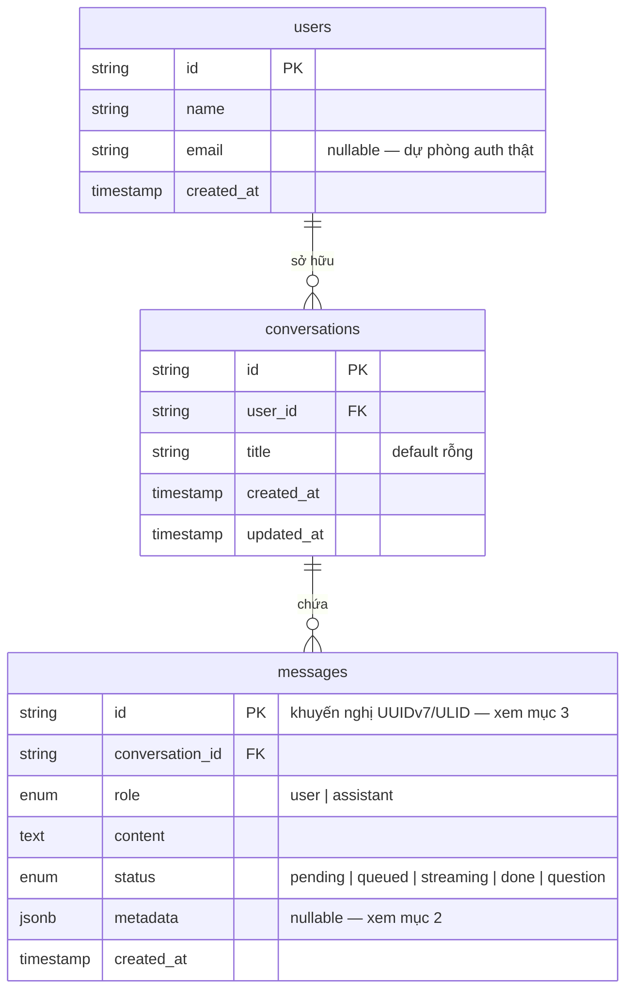

# DB Diagram — cơ bản (User / Conversation / Message)

Schema tối thiểu cho `app/models/` (hiện đang trống — chưa implement, xem
`../quy-uoc.md` mục 7 "Model SQLAlchemy mới" cho cách thêm). Đứng sau các endpoint ở
[`api-doc.md`](./api-doc.md) và [`async-api-doc.md`](./async-api-doc.md).

## 1. Sơ đồ



`users` hiện chỉ đủ cho `userId` truyền tay từ client (chưa có auth thật — xem `api-doc.md`
mục 0). `email` để sẵn chỗ, chưa dùng.

## 2. Quy ước `messages.metadata` (JSONB)

### Vì sao 1 cột JSONB thay vì nhiều cột/bảng con

`ChatMessage` (nguồn chuẩn: `fe/features/chat/types.ts`) có **6 field optional tuỳ loại tin
nhắn**: `reasoning` (assistant), `selectionRef` (user quote-then-ask), `attachments` (tệp user
**upload kèm tin nhắn**), `choice` (assistant hỏi lại), `sources` (assistant trích dẫn),
`isOptionResponse` (user trả lời choice). Mỗi tin nhắn thường chỉ có 0–2 field trong số này.

> Không gồm `document` (văn bản canvas do agent soạn, chỉnh sửa qua OnlyOffice) — luồng hiện
> tại của dự án chỉ có chat + reasoning, chưa có tính năng soạn văn bản. `attachments` ở đây
> là tệp **người dùng tải lên** (khác hẳn với canvas do agent tạo ra).

Chọn **1 cột `metadata JSONB` duy nhất** thay vì cột riêng/bảng con cho từng loại vì:

- **Luôn đọc/ghi nguyên khối theo message** — FE render 1 message là render toàn bộ field
  optional của nó cùng lúc; không có truy vấn nào cần lọc *bên trong* metadata (vd "tìm mọi
  message có `sources` chứa tài liệu X") ở giai đoạn hiện tại → không cần JOIN qua bảng con.
  Xem mục 5 "Persist" trong `async-api-doc.md`: assistant message ghi 1 lần duy nhất lúc
  `message.done`, không update dần từng field.
  - Nếu sau này thật sự cần lọc/JOIN theo 1 loại field cụ thể (vd báo cáo theo `sources`),
    tách field đó ra bảng con riêng lúc đó — không tách trước khi có nhu cầu thật.
- **Schema phía FE còn đang tiến hoá** — `fe/docs/backend-contract.md` mục 7 cho thấy field
  mới được thêm liên tục qua các version (vd 1.5 thêm `sources`). JSONB không cần migration DB
  mỗi lần FE thêm 1 field metadata mới; chỉ cần cập nhật DTO Pydantic (mục 2.2) — cột DB không
  đổi.
- **Postgres JSONB hỗ trợ index khi cần** (GIN) — không đánh đổi khả năng truy vấn nếu sau
  này phát sinh nhu cầu, chỉ là chưa cần bây giờ.

### Shape (validate qua Pydantic DTO, không lưu dict tuỳ tiện)

`messages.metadata` **không bao giờ** được ghi/đọc như 1 dict thô — luôn đi qua
`MessageMetadataDto` (đặt ở `app/dto/message.py` khi triển khai), mọi field optional, mirror
đúng `ChatMessage` phía FE:

```python
class MessageMetadataDto(BaseModel):
    model_config = ConfigDict(alias_generator=to_camel, populate_by_name=True)

    reasoning: list[ReasoningStepDto] | None = None          # chỉ tin assistant
    selection_ref: MessageSelectionRefDto | list[MessageSelectionRefDto] | None = None
    attachments: list[FileAttachmentDto] | None = None         # tệp user upload kèm tin nhắn
    choice: MessageChoiceDto | None = None                     # chỉ tin assistant (hỏi lại)
    sources: list[ChatSourceDto] | None = None                 # chỉ tin assistant
    is_option_response: bool | None = None                     # chỉ tin user (trả lời choice)
```

- Ghi: `MessageMetadataDto(...).model_dump(mode="json", exclude_none=True)` trước khi lưu
  vào cột `metadata` — `exclude_none=True` để không lưu field rỗng tràn lan (message đa số
  chỉ có 1–2 field, giữ JSON gọn).
- Đọc: `MessageMetadataDto.model_validate(row.metadata or {})` — validate lại khi đọc ra,
  không trust thẳng dict từ DB (dù cùng 1 hệ thống ghi, vẫn nên validate vì DB không ép kiểu
  JSONB theo schema).
- 1 message có `metadata=None` (không field nào) là hợp lệ — phần lớn tin nhắn text đơn giản
  sẽ như vậy.

### ⚠️ SQLAlchemy: không đặt tên attribute Python là `metadata`

`Base.metadata` (từ `DeclarativeBase`, `app/db/base.py`) là tên **reserved** của SQLAlchemy —
đặt attribute model là `metadata` sẽ đè lên `MetaData` của class, lỗi ngay lúc định nghĩa
model. Dùng tên khác cho attribute Python, map sang cột DB tên `metadata` qua `mapped_column`:

```python
class Message(Base):
    __tablename__ = "messages"

    id: Mapped[str] = mapped_column(String(36), primary_key=True)
    conversation_id: Mapped[str] = mapped_column(ForeignKey("conversations.id"))
    role: Mapped[str] = mapped_column(String(20))
    content: Mapped[str] = mapped_column(Text)
    status: Mapped[str] = mapped_column(String(20))
    extra: Mapped[dict | None] = mapped_column("metadata", JSONB, default=None)  # ← tên cột DB vẫn là "metadata"
    created_at: Mapped[datetime] = mapped_column(DateTime, default=datetime.utcnow)
```

Đặt tên attribute Python là `extra` (không phải `metadata_` có gạch dưới xấu) — quy ước cho
dự án này, ghi rõ ở đây để không ai đặt lại `metadata` rồi dính lỗi.

## 3. `id` — khuyến nghị UUIDv7/ULID thay vì UUIDv4

Theo `async-api-doc.md` mục 4 (Steer), thứ tự bắt buộc trong DB là
`Initial User Message → Steer User Message → Assistant Message`. Sắp theo `created_at` là đủ
cho hầu hết trường hợp, nhưng 2 write có thể cùng timestamp (độ phân giải đồng hồ, ghi đồng
thời) → nên chọn **id có thể sắp thứ tự theo thời gian** (UUIDv7 hoặc ULID) làm khoá phụ khi
sort (`ORDER BY created_at, id`), tránh phụ thuộc hoàn toàn vào độ chính xác timestamp. Không
bắt buộc ngay — ghi nhận làm khuyến nghị khi implement `app/models/message.py`.

## 4. `role` / `status` — enum ở tầng nào

Khuyến nghị: cột DB kiểu `String` (không dùng Postgres native `ENUM`) + validate giá trị hợp
lệ qua Python `Literal` trong DTO/model — native `ENUM` của Postgres khó `ALTER` thêm giá trị
sau này (vd `status` đã có tiền lệ đổi nhiều lần: bản đầu `streaming|done|queued`, sau thêm
`question`, và `pending` — trạng thái tin nhắn Steer trước khi `pre_step` kịp append vào
context, xem `async-api-doc.md` mục 5 — hiện **chưa có** trong `MessageStatus` phía FE, cần
đồng bộ 2 bên trước khi trả ra API). `String` + validate tầng ứng dụng đánh đổi 1 chút an toàn
ở DB level để đổi lấy migration rẻ hơn khi thêm giá trị mới — hợp lý cho giai đoạn contract
còn đang tiến hoá nhanh như hiện tại.

## 5. Khoảng cách với code hiện tại

`app/models/` hiện trống (chỉ có `Base`, xem `app/models/__init__.py`). Schema ở tài liệu này
là đặc tả để implement — theo đúng quy trình "Model SQLAlchemy mới" ở `../quy-uoc.md` mục 7
(tạo file trong `app/models/`, import trong `app/models/__init__.py`).
