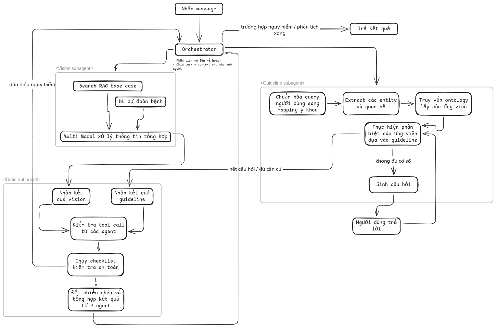

# Idea chung
- Mô phỏng quá trình bác sỹ thực hiện chẩn đoán lâm sàng cho bệnh nhân

## Thiết kế các role agent và vai trò
- Orchestrator:
    - Vai trò:
        - Lập plan, track plan, tự động điều hướng, thay đổi plan dựa trên kết quả mỗi vòng lặp
        - Quyết định việc cung cấp context khởi tạo nào cho các agent con
    - Input:
        - Profile chung của người dùng, đoạn tin nhắn hội thoại gần đây
    - Công cụ:
        - Track state hiện tại + lên plan
    - Output: quyết định gọi agent nào tiếp theo + tổng hợp kết luận cuối kèm độ tin cậy
- Vision agent:
    - Vai trò:
        - Phân tích ảnh độc lập dựa trên các pattern dữ liệu
        - Truy xuất các case base rag để tổng hợp thông tin
    - Input:
        - Ảnh được cung cấp bởi orchestrator
        - Một vài note cơ bản
    - Công cụ:
        - Mô hình DL dự đoán bệnh da liễu
        - Search case base rag dựa trên ảnh được cung cấp
    - Output: nhãn bệnh + xác suất + case tham chiếu (ảnh + nguồn)
- Guideline agent:
    - Vai trò:
        - Phỏng theo quá trình khám của 1 bác sỹ
        - Dựa theo các kiến thức y khoa, thông tin tiền sử bệnh nhân, hướng dẫn tư vấn lâm sàng -> thực hiện lên plan hỏi đáp và đưa ra kết luận độc lập
    - Input:
        - Mô tả triệu chứng chủ quan từ người bệnh
    - Công cụ:
        - RAG tài liệu y khoa hướng dẫn lâm sàng
        - RAG lịch sử thăm khám
        - Bảng mapping thuật ngữ
    - Output: chẩn đoán phân biệt (differential) có xếp hạng + câu hỏi còn thiếu (nếu chưa đủ căn cứ) + trích dẫn guideline
- Critic Agent: đánh giá chất lượng của các agent:
    - Vai trò:
        - Đánh giá các câu trả lời của 2 agent chuyên gia trên đã đủ căn cứ chưa (thông qua việc sử dụng các công cụ của chúng tránh ảo giác)
        - Tìm ra khoảng trống, mâu thuẫn giữa các kết luận của 2 agent -> đưa cho orchestrator xử lý
    - Output:
        - Kết quả reverify dựa trên tool mà 2 agent chuyên gia đã gọi
        - Checklist kiểm tra

## Phân nhóm nguồn dữ liệu

### Dữ liệu hướng dẫn lâm sàng
- Nguồn: phác đồ điều trị, guideline chẩn đoán (Bộ Y tế, hội chuyên khoa, guideline quốc tế đã dịch/đối chiếu)
- Định dạng lưu trữ: văn bản chia chunk theo mục (chỉ định, chống chỉ định, tiêu chí loại trừ, red flag) kèm metadata (chuyên khoa, phiên bản, năm ban hành)
- Mục đích sử dụng: nạp cho RAG của Guideline agent; đồng thời là nguồn gốc để dựng Ontology triệu chứng-bệnh (trích xuất quan hệ triệu chứng → chẩn đoán từ guideline bằng LLM + review chuyên gia)
- Yêu cầu chất lượng: mỗi đoạn trích dẫn được Guideline agent dùng phải truy vết được về đúng văn bản gốc + phiên bản, để Critic Agent verify
- **Nguồn miễn phí cụ thể**:
    - **Bộ Y tế Việt Nam**: "Hướng dẫn chẩn đoán và điều trị các bệnh Da liễu" ban hành kèm Quyết định 4416/QĐ-BYT (06/12/2023) — PDF chính thức, tải tại kcb.vn hoặc website các bệnh viện đã đăng lại (vd bvtn.org.vn, benhvientinh.quangtri.gov.vn). Đây là nguồn tiếng Việt gốc, độ ưu tiên cao nhất vì khớp trực tiếp bối cảnh người dùng Việt Nam
    - **WHO Guidelines**: apps.who.int/iris — kho guideline mở của WHO, có bản dịch/tương đương cho một số bệnh da liễu, nhiễm trùng
    - **NICE Guidelines (Anh)**: nice.org.uk/guidance — miễn phí đọc online, có syndication API để tải hàng loạt (dùng để tham chiếu chéo khi guideline Việt Nam chưa cập nhật)
    - **MedlinePlus** (medlineplus.gov): nội dung y tế công cộng miễn phí của US National Library of Medicine, tốt cho lớp "note bình dân" giúp Guideline agent hiểu diễn đạt không chuyên
    - **MEDITRON clinical guidelines corpus** (huggingface.co, epfl-llm/meditron): tập ~46K clinical practice guideline đã crawl sẵn từ nhiều nguồn công khai, dùng để bootstrap nhanh trước khi thay bằng nguồn Việt Nam chính thức
    - Cách xử lý: OCR/parse PDF → chia chunk theo mục (chỉ định/chống chỉ định/chẩn đoán phân biệt) → gắn metadata nguồn + phiên bản → nạp vector DB cho RAG

### Dữ liệu ảnh và kết luận
- Nguồn: ảnh da liễu (dermoscopic/ảnh thường) gắn nhãn chẩn đoán xác định (ground truth, đã có sinh thiết/xác nhận chuyên khoa nếu có)
- Định dạng: ảnh + nhãn bệnh (mã ICD hoặc mã ontology nội bộ) + độ tin cậy của nhãn (đã xác nhận mô bệnh học / chỉ xác nhận lâm sàng)
- Mục đích sử dụng: train/fine-tune và đánh giá mô hình DL dự đoán bệnh da liễu; là nguồn build case base cho Vision agent search theo ảnh
- **Nguồn miễn phí cụ thể**:
    - **ISIC Archive** (isic-archive.com): kho ảnh dermoscopic lớn nhất, giấy phép CC-0, hơn 485.000 ảnh công khai, chủ yếu tổn thương sắc tố (nốt ruồi, melanoma)
    - **HAM10000** (10.015 ảnh dermoscopic, 7 nhãn bệnh phổ biến, ground truth xác nhận bằng mô bệnh học/theo dõi lâm sàng/soi tại chỗ — tải qua Harvard Dataverse hoặc ISIC)
    - **BCN20000** (~20.000 ảnh, bổ sung các vị trí khó chẩn đoán như móng, niêm mạc) — cùng hệ với HAM10000 trên ISIC
    - **Fitzpatrick17k** (16.577 ảnh lâm sàng "in the wild", 114 nhãn bệnh, có gắn thang màu da Fitzpatrick I–VI — quan trọng để tránh model lệch về da trắng)
    - **PAD-UFES-20** (2.298 ảnh chụp bằng smartphone kèm tới 22 đặc điểm lâm sàng/bệnh nhân đi kèm mỗi ảnh — hữu ích vì gần với điều kiện chụp ảnh thực tế của người dùng phổ thông hơn ảnh dermoscopic chuyên dụng)
    - **Derm12345**: dataset dermoscopic đa nguồn với 40 phân lớp con, mới công bố, license mở cho nghiên cứu
    - Cách xử lý: chuẩn hoá kích thước/định dạng, lọc trùng lặp và ảnh nhiễu (đã có pipeline tham khảo từ các nghiên cứu kiểm định chất lượng HAM10000/Fitzpatrick17k), ánh xạ nhãn bệnh gốc về chung một hệ mã (ontology nội bộ) trước khi train

### Dữ liệu ảnh và các nhận định lâm sàng từ bác sỹ
- Nguồn: ảnh kèm ghi chú tự do của bác sỹ (mô tả hình thái tổn thương, vị trí, phân bố, diễn tiến theo thời gian, các dấu hiệu đi kèm)
- Khác biệt so với nhóm trên: đây là dữ liệu "suy luận" chứ không chỉ nhãn cuối — dùng để dạy Vision agent lý do vì sao một case được xếp vào chẩn đoán đó, không chỉ kết quả
- Mục đích sử dụng: làm giàu case base RAG (mỗi case trả về không chỉ ảnh tương tự mà cả nhận định gốc của bác sỹ), hỗ trợ Critic Agent đối chiếu lý do khi có mâu thuẫn
- **Nguồn miễn phí cụ thể**:
    - **SCIN — Skin Condition Image Network** (github.com/google-research-datasets/scin, Google + Stanford Medicine): >10.000 ảnh do chính người bệnh tự chụp và tự mô tả (kết cấu, thời gian xuất hiện, triệu chứng đi kèm), được 1-3 bác sỹ da liễu gán nhãn kèm điểm tin cậy và differential diagnosis tổng hợp có trọng số. Đây là nguồn khớp gần như chính xác với định nghĩa nhóm dữ liệu này của bạn — vừa có ảnh, vừa có mô tả chủ quan của "bệnh nhân", vừa có nhận định differential của bác sỹ
    - **DDI — Diverse Dermatology Images**: 656 ảnh kèm nhãn ác tính/lành tính và thông tin thang màu da, tập trung vào tính công bằng giữa các tông da
    - **PASSION**: dataset da liễu nhi khoa từ châu Phi cận Sahara (Madagascar, Guinea, Malawi, Tanzania), hữu ích nếu cần đa dạng hoá phổ bệnh ngoài các dataset gốc châu Âu/Mỹ
    - **DermNet** (dermnetnz.org, dùng cho mục đích giáo dục/nghiên cứu phi thương mại): ảnh kèm bài viết mô tả lâm sàng chi tiết do bác sỹ da liễu biên soạn — có thể trích xuất cặp ảnh-mô tả để làm giàu case base
    - Cách xử lý: giữ nguyên cặp (ảnh, mô tả tự nhiên của bệnh nhân, nhận định bác sỹ) làm một "case record" hoàn chỉnh trong case base RAG, không tách rời ảnh khỏi text — vì giá trị chính là ở suy luận đi kèm chứ không chỉ nhãn

### Dữ liệu mapping các ngôn ngữ y khoa
- Nguồn: bảng đối chiếu thuật ngữ dân gian/khẩu ngữ người bệnh mô tả (vd "nổi mẩn đỏ ngứa") với thuật ngữ y khoa chuẩn (vd "sẩn hồng ban ngứa"), và đối chiếu song ngữ Việt-Anh với mã ICD-10/SNOMED CT
- Định dạng: bảng ánh xạ nhiều-nhiều (synonym set) gắn về một node chuẩn hoá duy nhất trong ontology
- Mục đích sử dụng: chuẩn hoá input trước khi đưa vào Guideline agent/Vision agent, tránh lệch nghĩa khi truy xuất RAG; đồng thời là lớp "alias" gắn vào node của Ontology triệu chứng-bệnh (không tách rời hoàn toàn khỏi ontology, mà là thuộc tính của node)
- **Nguồn miễn phí cụ thể**:
    - **UMLS Metathesaurus** (nlm.nih.gov/research/umls): miễn phí xin license (đăng ký tài khoản UTS, không mất phí với hầu hết mục đích nghiên cứu), tích hợp sẵn cross-mapping giữa ICD-10, SNOMED CT, MeSH, RxNorm, LOINC quanh một concept ID chung — đây là "xương sống" chuẩn cho toàn bộ lớp mapping thuật ngữ
    - **SNOMED CT**: miễn phí sử dụng tại các quốc gia thành viên IHTSDO và cho các dự án nghiên cứu đủ điều kiện ở bất kỳ quốc gia nào (đăng ký Affiliate License qua SNOMED International) — Việt Nam có thể xin theo diện Qualifying Research Project nếu chưa là thành viên chính thức
    - **ICD-10/ICD-10-CM**: WHO công bố mã bệnh miễn phí (icd.who.int); có sẵn map SNOMED CT → ICD-10-CM do NLM duy trì để tự động sinh mã từ thuật ngữ lâm sàng
    - **Từ điển y khoa Việt-Anh mở**: các glossary công khai từ tài liệu đào tạo của Bộ Y tế (vd giáo trình "Da liễu học dùng cho đào tạo bác sĩ đa khoa") — dùng làm nguồn thô để tự xây bảng đối chiếu khẩu ngữ người bệnh (tiếng Việt) ↔ thuật ngữ chuẩn ↔ mã UMLS/ICD
    - Cách xử lý: với thuật ngữ tiếng Việt chưa có trong UMLS, dùng LLM để đề xuất ánh xạ sang concept UMLS gần nhất rồi có chuyên gia review, thay vì tạo một ontology tiếng Việt tách biệt hoàn toàn

### Dữ liệu ontology về mối quan hệ giữa triệu chứng và bệnh
- Nguồn: trích xuất từ dữ liệu hướng dẫn lâm sàng + đối chiếu chuẩn quốc tế (tương đương UMLS/SNOMED CT cho các khái niệm triệu chứng, bệnh, quan hệ "gây ra bởi", "liên quan tới", "cờ đỏ của")
- Định dạng: đồ thị tri thức (graph DB) — node là triệu chứng/bệnh/xét nghiệm, cạnh là quan hệ có trọng số (tần suất đồng xuất hiện, mức độ đặc hiệu)
- Mục đích sử dụng: cho phép Guideline agent suy luận đa bước (multi-hop) từ tập triệu chứng sang danh sách chẩn đoán phân biệt có xếp hạng, thay vì chỉ tra cứu văn bản phẳng; đồng thời Critic Agent dùng graph này để phát hiện mâu thuẫn logic (vd triệu chứng bị agent đưa ra không có cạnh liên kết nào với chẩn đoán đã kết luận)
- **Nguồn miễn phí cụ thể**:
    - **PrimeKG** (github.com/mims-harvard/PrimeKG, Harvard Zitnik Lab, mở hoàn toàn): tích hợp 20 nguồn y sinh uy tín, mô tả 17.080 bệnh với hơn 4 triệu quan hệ trên 10 tầng sinh học (bao gồm quan hệ bệnh-kiểu hình/triệu chứng), kèm sẵn mô tả text guideline lâm sàng đi cùng graph — có thể dùng gần như trực tiếp làm khung ontology chính
    - **Human Phenotype Ontology — HPO** (hpo.jax.org, Monarch Initiative): hơn 18.000 thuật ngữ kiểu hình/triệu chứng và hơn 156.000 chú thích liên kết bệnh-kiểu hình, mở hoàn toàn, là nguồn chuẩn cho quan hệ triệu chứng ↔ bệnh
    - **DisGeNET** (disgenet.org): dữ liệu liên kết gene-bệnh đã được chọn lọc (curated), tải miễn phí dạng TSV, dùng bổ sung tầng sinh học/di truyền nếu hệ thống mở rộng sang bệnh không chỉ da liễu
    - **Disease Ontology (DO)** (disease-ontology.org): phân loại và quan hệ phả hệ giữa các bệnh, mở hoàn toàn, dùng làm khung phân loại bậc cao (nhiễm khuẩn/tự miễn/dị ứng/u...) khớp với cấu trúc chương trong guideline Bộ Y tế
    - **SymCat / bộ dữ liệu hội thoại chẩn đoán mở** (github.com/Guardianzc/DISCOpen-MedBox-DialoDiagnosis — gồm SymCat, MZ-4, Dxy, MZ-10): các cặp triệu chứng tường minh/ẩn kèm chẩn đoán bác sỹ, có sẵn công cụ mô phỏng bệnh nhân — hữu ích để test vòng lặp hỏi-đáp của Guideline agent, tuy cần lưu ý SymCat có mô tả triệu chứng khá sơ sài cho một số bệnh hiếm nên nên ưu tiên dùng làm dữ liệu test/mô phỏng hơn là nguồn ontology chính
    - Cách xử lý: dùng PrimeKG/HPO làm khung gốc (đã ở dạng graph chuẩn UMLS/MONDO), sau đó lọc và làm giàu thêm riêng phần bệnh da liễu bằng quan hệ trích xuất từ guideline Bộ Y tế (qua LLM extraction + review chuyên gia), gắn alias tiếng Việt từ bảng mapping thuật ngữ vào cùng node

## Data output của các agent

Tất cả agent chuyên gia (Vision, Guideline) và Critic nên trả về theo một **contract chung** để Orchestrator xử lý thống nhất, gồm 4 trường bắt buộc:

| Trường | Ý nghĩa |
|---|---|
| `conclusion` | Kết luận chính (nhãn bệnh / danh sách differential có xếp hạng) |
| `evidence` | Danh sách bằng chứng đã dùng — mỗi bằng chứng trỏ về đúng tool/case/đoạn guideline đã gọi (id truy vết được) |
| `confidence` | Độ tin cậy nội tại của agent (không phải điểm cuối cùng, chỉ là input cho Orchestrator/Critic) |
| `open_questions` | Những thông tin còn thiếu để chốt kết luận (nếu có) |

Cụ thể theo từng agent:

- **Vision agent output**: nhãn bệnh + xác suất theo top-k, danh sách case tham chiếu (ảnh + nguồn + độ tương đồng), vùng ảnh nổi bật (saliency) làm căn cứ trực quan cho bác sỹ/Critic kiểm tra
- **Guideline agent output**: differential diagnosis có xếp hạng, câu hỏi còn thiếu để thu hẹp differential, trích dẫn guideline (tên tài liệu + mục + phiên bản) cho từng chẩn đoán được đề xuất
- **Critic Agent output**:
    - Kết quả reverify: với mỗi evidence mà Vision/Guideline agent đưa ra, Critic gọi lại đúng tool gốc (không tạo tool riêng) để xác nhận evidence đó có thực sự tồn tại và được dùng đúng ngữ cảnh không
    - Checklist kiểm tra: danh sách các tiêu chí an toàn tối thiểu (vd "đã loại trừ cờ đỏ chưa", "chẩn đoán có mâu thuẫn với dữ liệu ảnh không", "độ tin cậy hai agent có lệch nhau bất thường không")
    - `conflict_report`: liệt kê điểm mâu thuẫn/khoảng trống giữa 2 agent chuyên gia kèm mức độ nghiêm trọng, để Orchestrator quyết định có cần vòng lặp hỏi thêm hay không
- **Orchestrator output**: như đã định nghĩa — quyết định agent kế tiếp (nếu plan chưa xong) hoặc kết luận tổng hợp cuối kèm độ tin cậy tổng thể (được tính từ confidence của các agent chuyên gia, đã điều chỉnh theo conflict_report của Critic)

## Pipeline xử lý

### Pipeline xử lý chung

1. **Intake**: nhận input đầu vào (tin nhắn, ảnh nếu có) + profile người dùng
2. **Lập plan (Orchestrator)**: dựa trên loại input, quyết định cần agent nào (có ảnh → gọi Vision agent; luôn gọi Guideline agent để khai thác bệnh sử/triệu chứng chủ quan)
3. **Thực thi agent chuyên gia**: Vision agent và Guideline agent chạy độc lập (song song nếu không phụ thuộc nhau, tuần tự nếu Guideline agent cần kết quả sơ bộ của Vision agent làm ngữ cảnh)
4. **Kiểm chứng (Critic Agent)**: nhận output của cả hai agent chuyên gia, reverify evidence qua đúng tool gốc, chạy checklist, sinh conflict_report
5. **Vòng lặp quyết định (Orchestrator)**:
    - Nếu Critic báo đủ căn cứ, không mâu thuẫn → tổng hợp kết luận cuối
    - Nếu còn open_questions hoặc conflict → Orchestrator cập nhật lại plan: có thể hỏi thêm người bệnh (qua Guideline agent), yêu cầu thêm ảnh (qua Vision agent), hoặc gọi lại RAG với truy vấn hẹp hơn
    - Lặp lại bước 3-5 cho tới khi đạt ngưỡng tin cậy hoặc hết số vòng lặp cho phép
6. **Tổng hợp & bàn giao**: Orchestrator trả kết luận cuối kèm độ tin cậy, danh sách bằng chứng đã dùng, và khuyến nghị bước tiếp theo (tự theo dõi / khám chuyên khoa) — luôn có disclaimer và đường dẫn tới bác sỹ thật với các case độ tin cậy thấp hoặc có cờ đỏ

### Pipeline xử lý chuyên biệt của các agent

**Orchestrator**
1. Đọc state hiện tại (đã hỏi gì, đã có kết quả gì, còn thiếu gì)
2. Đối chiếu state với plan ban đầu, quyết định bước kế tiếp
3. Soạn context khởi tạo tối thiểu cần thiết cho agent con được gọi (tránh nhồi toàn bộ lịch sử hội thoại)
4. Ghi nhận kết quả trả về vào state, cập nhật lại plan nếu cần

**Vision agent**
1. Tiền xử lý ảnh (chuẩn hoá kích thước, kiểm tra chất lượng ảnh đầu vào — từ chối/yêu cầu chụp lại nếu ảnh mờ/thiếu sáng)
2. Chạy mô hình DL để ra top-k nhãn bệnh + xác suất
3. Dùng embedding ảnh để search case base RAG, lấy case tương tự nhất kèm nhận định bác sỹ gốc (từ nhóm dữ liệu "ảnh + nhận định lâm sàng")
4. Đối chiếu kết quả model DL với case retrieval — nếu hai nguồn lệch nhau nhiều, hạ confidence và ghi vào open_questions
5. Trả output theo contract chung

**Guideline agent**
1. Chuẩn hoá mô tả triệu chứng của người bệnh qua bảng mapping thuật ngữ
2. Truy vấn Ontology triệu chứng-bệnh để lấy tập chẩn đoán ứng viên ban đầu (multi-hop từ triệu chứng)
3. Truy xuất RAG guideline + RAG lịch sử thăm khám để lấy tiêu chí chẩn đoán/loại trừ cho từng ứng viên
4. Nếu thông tin chưa đủ để phân biệt các ứng viên → sinh câu hỏi tiếp theo (mô phỏng hỏi bệnh của bác sỹ), chờ trả lời rồi lặp lại bước 2-4
5. Khi đủ căn cứ (hoặc hết ngân sách vòng hỏi) → chốt differential có xếp hạng kèm trích dẫn guideline, trả output theo contract chung

**Critic Agent**
1. Nhận output của Vision agent và Guideline agent
2. Với mỗi evidence trong `evidence`, gọi lại đúng tool gốc (RAG guideline, RAG case base, ontology) để xác nhận evidence có tồn tại và được trích đúng ngữ cảnh — không tự phán đoán bằng suy luận nội tại của Critic
3. Chạy checklist an toàn tối thiểu (loại trừ cờ đỏ, kiểm tra chẩn đoán có mâu thuẫn với dữ liệu ảnh không, kiểm tra độ lệch confidence giữa 2 agent)
4. Đối chiếu chéo kết luận của Vision agent và Guideline agent qua Ontology triệu chứng-bệnh: nếu chẩn đoán của agent này không có cạnh liên kết hợp lý với bằng chứng của agent kia → đánh dấu mâu thuẫn
5. Trả `conflict_report` + checklist result cho Orchestrator xử lý

