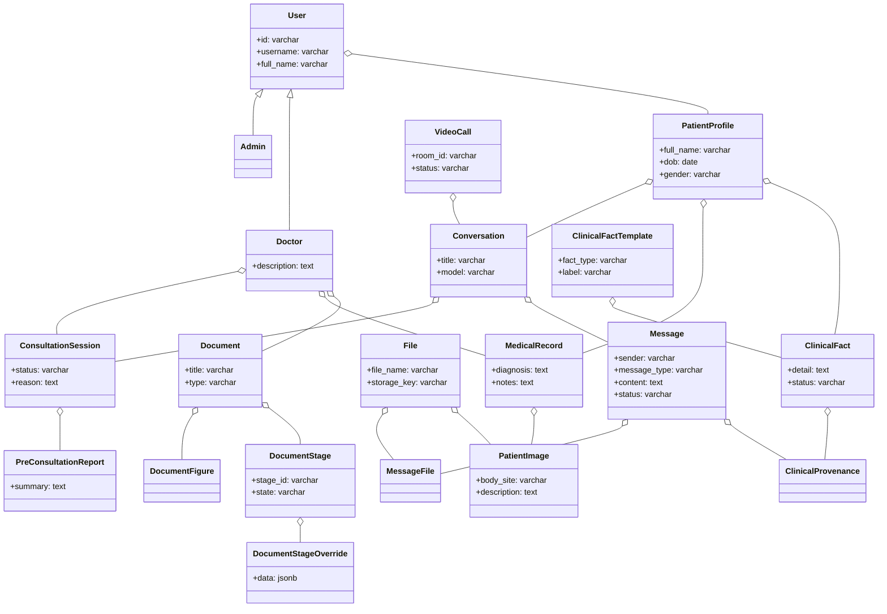

# Thiết Kế Database

## 1. Thiết Kế Class

> *Sơ đồ lớp (Class Diagram) thể hiện mối quan hệ giữa các thực thể hệ thống: Người dùng, Hội thoại, Buổi tư vấn, Hồ sơ bệnh án, Dữ kiện lâm sàng và Pipeline tài liệu.*

---

## 2. Thiết Kế CSDL

### 2.1. Sơ Đồ Cơ Sở Dữ Liệu

*(Tham khảo chi tiết tại liên kết DBDiagram đính kèm tài liệu)*

---

### 2.2. Giải Thích Bảng

#### 2.2.1. Nhóm Người Dùng

##### `users` — Tài khoản
Field chung của mọi loại tài khoản. Vai trò bác sĩ / quản trị là bảng con 1-1 (`doctors`, `admins`), bệnh nhân là `patient_profiles`. Chưa có API đăng ký / đăng nhập.

| Field | Kiểu | Null | Ý nghĩa |
| :--- | :--- | :---: | :--- |
| `id` | varchar(64) PK | Không | Mã tài khoản, DB sinh. |
| `username` | varchar(64) | Không, Unique | Tên đăng nhập. |
| `full_name` | varchar(255) | Không | Họ tên đầy đủ. |
| `dob` | date | Không | Ngày sinh. |
| `gender` | varchar(16) | Không | `male` \| `female`. |
| `password_hash` | varchar(255) | Có | Hash mật khẩu. NULL = tài khoản mẫu chưa đặt mật khẩu, chưa đăng nhập được. |
| `created_at` | timestamptz | Không | Thời điểm tạo tài khoản. |

##### `patient_profiles` — Hồ sơ bệnh nhân
Một tài khoản quản lý được nhiều hồ sơ (bản thân, người nhà). Hội thoại, bệnh án và dữ kiện lâm sàng đều gắn vào hồ sơ này, không gắn thẳng vào `users`.

| Field | Kiểu | Null | Ý nghĩa |
| :--- | :--- | :---: | :--- |
| `id` | varchar(64) PK | Không | Mã hồ sơ. |
| `user_id` | varchar(64) FK → users.id | Không | Tài khoản quản lý hồ sơ. `ON DELETE CASCADE`. Có index. |
| `full_name` | varchar(255) | Không | Họ tên người bệnh (có thể khác chủ tài khoản). |
| `dob` | date | Không | Ngày sinh người bệnh. |
| `gender` | varchar(16) | Không | `male` \| `female`. |
| `created_at` | timestamptz | Không | Thời điểm tạo hồ sơ. |

##### `doctors` — Vai trò bác sĩ
Quan hệ 1-1 với `users`: PK đồng thời là FK nên một user chỉ có tối đa một dòng bác sĩ. Các bảng khác trỏ vào `doctors.user_id` (không phải `users.id`) để DB chặn việc gán người không phải bác sĩ.

| Field | Kiểu | Null | Ý nghĩa |
| :--- | :--- | :---: | :--- |
| `user_id` | varchar(64) PK, FK → users.id | Không | Tài khoản được cấp vai trò bác sĩ. `ON DELETE CASCADE`. |
| `description` | text | Không | Giới thiệu chuyên môn của bác sĩ. |

##### `admins` — Vai trò quản trị
Quan hệ 1-1 với `users`, đánh dấu tài khoản quản trị (khu `/admin/documents`). Chưa có field riêng.

| Field | Kiểu | Null | Ý nghĩa |
| :--- | :--- | :---: | :--- |
| `user_id` | varchar(64) PK, FK → users.id | Không | Tài khoản quản trị. `ON DELETE CASCADE`. |

---

#### 2.2.2. Nhóm Hội Thoại & Tư Vấn

##### `conversations` — Cuộc hội thoại
Một cuộc chat của một hồ sơ bệnh nhân. Chủ tài khoản suy ra qua `patient_profiles.user_id`, không lưu lặp ở đây.

| Field | Kiểu | Null | Ý nghĩa |
| :--- | :--- | :---: | :--- |
| `id` | varchar(64) PK | Không | Mã hội thoại. |
| `patient_profile_id` | varchar(64) FK → patient_profiles.id | Không | Hồ sơ bệnh nhân sở hữu hội thoại. |
| `title` | varchar(255) | Không, mặc định `''` | Tiêu đề hiển thị trong danh sách chat. |
| `model` | varchar(32) | Không | Id ngắn của model trong `AGENT_MODEL_CHOICES` (không phải chuỗi `provider:model`); worker tự map sang model thật khi chạy lượt, nên đổi danh sách model không cần migration. |
| `created_at` | timestamptz | Không | Thời điểm tạo. |
| `updated_at` | timestamptz | Không | Lần cập nhật gần nhất (tự cập nhật khi sửa). |

##### `messages` — Tin nhắn
Một luồng chung cho AI, bệnh nhân và bác sĩ, phân biệt bằng `sender`. Các mốc tư vấn và cuộc gọi video cũng hiện thành tin trong luồng này.

| Field | Kiểu | Null | Ý nghĩa |
| :--- | :--- | :---: | :--- |
| `id` | varchar(64) PK | Không | Mã tin nhắn. |
| `conversation_id` | varchar(64) FK → conversations.id | Không | Hội thoại chứa tin. |
| `sender` | varchar(20) | Không | Người gửi: `patient` \| `ai` \| `doctor`. |
| `message_type` | varchar(32) | Không, mặc định `text` | Loại tin: `text`, `attached` (có đính kèm), `video_call`, `consultation_requested`, `consultation_accepted`, `consultation_resolved`. Là cột riêng để lọc / đếm theo loại. |
| `video_call_id` | varchar(64) FK → video_calls.id | Có | Chỉ điền với `message_type = video_call`. `ON DELETE SET NULL`. |
| `consultation_session_id` | varchar(64) FK → consultation_sessions.id | Có | Chỉ điền với 3 tin mốc `consultation_*`: tin thuộc phiên tư vấn nào. `ON DELETE SET NULL`. Có index. |
| `content` | text | Không, mặc định `''` | Nội dung chữ. |
| `status` | varchar(20) | Không | Trạng thái xử lý: `queued` \| `done` \| `question` (còn khai báo `pending` \| `streaming`). `question` = agent đang chờ người dùng trả lời. |
| `metadata` | jsonb | Có | Dữ liệu phụ (ORM đặt tên attribute là `extra` vì metadata trùng tên reserved của SQLAlchemy). - **Tin AI:** `reasoning[]` (các bước lập luận), `choice` (câu hỏi lại), `sources[]` (nguồn trích dẫn). - **Tin người dùng:** `attached_files`, `is_option_response`. |
| `created_at` | timestamptz | Không | Thời điểm tạo tin. |

##### `message_files` — Tệp đính kèm của tin nhắn (n-n)
Bảng nối giữa tin nhắn và file. Một tin có thể đính kèm nhiều file, một file có thể được dùng lại ở nhiều chỗ.

| Field | Kiểu | Null | Ý nghĩa |
| :--- | :--- | :---: | :--- |
| `message_id` | varchar(64) PK, FK → messages.id | Không | Tin nhắn. `ON DELETE CASCADE`. |
| `file_id` | varchar(64) PK, FK → files.id | Không | File đính kèm. `ON DELETE CASCADE`. |

##### `consultation_sessions` — Phiên tư vấn bác sĩ
Mốc đánh dấu một lần bệnh nhân nhờ bác sĩ hỗ trợ; bảng này không chứa tin nhắn. Tin trao đổi nằm trong `messages` (`sender = doctor`), ba mốc yêu cầu / nhận / đóng là tin `consultation_*` trỏ về phiên. Bác sĩ xem luồng chat từ đầu đến tin `consultation_resolved` của phiên (phiên còn mở: tới hiện tại). Bệnh nhân vẫn chat AI song song. *(Mới có schema)*.

| Field | Kiểu | Null | Ý nghĩa |
| :--- | :--- | :---: | :--- |
| `id` | varchar(64) PK | Không | Mã phiên. |
| `conversation_id` | varchar(64) FK → conversations.id | Không | Hội thoại có phiên tư vấn. `ON DELETE CASCADE`. Có index. |
| `doctor_id` | varchar(64) FK → doctors.user_id | Có | Bác sĩ nhận ca. NULL khi chưa ai nhận. `ON DELETE SET NULL`. |
| `status` | varchar(16) | Không, mặc định `pending` | `pending` (chờ bác sĩ nhận) → `active` (đang trao đổi) → `resolved` (đã đóng). |
| `reason` | text | Không | Lý do bệnh nhân nhờ bác sĩ. |
| `requested_at` | timestamptz | Không | Lúc bệnh nhân gửi yêu cầu. |
| `started_at` | timestamptz | Có | Lúc bác sĩ nhận. |
| `resolved_at` | timestamptz | Có | Lúc đóng phiên. |

**Ràng buộc & Chỉ mục:**
- **CHECK `doctor_when_not_pending`**: `status = 'pending' OR doctor_id IS NOT NULL` — phiên đã nhận hoặc đã đóng thì bắt buộc có bác sĩ.
- **CHECK `resolved_at_when_resolved`**: `status <> 'resolved' OR resolved_at IS NOT NULL`.
- **Unique partial index `uq_consultation_sessions_open_per_conversation`** trên `conversation_id` với điều kiện `status <> 'resolved'` — mỗi hội thoại tối đa 1 phiên đang mở, tránh chồng chéo tin nhắn bác sĩ trong cùng khoảng thời gian.

##### `video_calls` — Cuộc gọi video
Tách bảng riêng (không chỉ nằm trong `messages.metadata`) vì cuộc gọi có vòng đời `pending` → `ongoing` → `ended` được cập nhật sau khi tin nhắn đã tạo. Tin `message_type = video_call` trỏ tới đây qua `messages.video_call_id`. *(Mới có schema)*.

| Field | Kiểu | Null | Ý nghĩa |
| :--- | :--- | :---: | :--- |
| `id` | varchar(64) PK | Không | Mã cuộc gọi. |
| `room_id` | varchar(128) | Không, Unique | Mã phòng video. |
| `status` | varchar(16) | Không, mặc định `pending` | `pending` \| `ongoing` \| `ended`. |
| `started_at` | timestamptz | Có | Lúc bắt đầu gọi. |
| `ended_at` | timestamptz | Có | Lúc kết thúc. |
| `created_at` | timestamptz | Không | Lúc tạo cuộc gọi. |

---

#### 2.2.3. Nhóm Bệnh Án

##### `medical_records` — Bệnh án
Bệnh án do bác sĩ ghi cho một hồ sơ bệnh nhân; một hồ sơ có nhiều bệnh án. Không gắn với phiên tư vấn cụ thể. *(Mới có schema)*.

| Field | Kiểu | Null | Ý nghĩa |
| :--- | :--- | :---: | :--- |
| `id` | varchar(64) PK | Không | Mã bệnh án. |
| `patient_profile_id` | varchar(64) FK → patient_profiles.id | Không | Hồ sơ bệnh nhân. `ON DELETE CASCADE`. Có index. |
| `doctor_id` | varchar(64) FK → doctors.user_id | Có | Bác sĩ ghi bệnh án. `ON DELETE SET NULL` — bác sĩ bị xoá thì bệnh án vẫn giữ. |
| `diagnosis` | text | Không | Chẩn đoán của bác sĩ. |
| `notes` | text | Không, mặc định `''` | Ghi chú thêm. |
| `is_reference_case` | boolean | Không, mặc định `false` | Ca bệnh tham khảo: bác sĩ xác nhận dùng làm dữ liệu cho KB / chatbot tra ca tương tự (phải ẩn định danh khi đưa vào KB). |
| `created_at` | timestamptz | Không | Lúc ghi bệnh án. |

##### `patient_images` — Ảnh bệnh
Ảnh bệnh do bác sĩ gắn vào bệnh án. Trỏ FK tới `files` thay vì chép file, nên bác sĩ chọn lại được ảnh bệnh nhân đã gửi trong chat mà không tạo bản sao trong MinIO. *(Mới có schema)*.

| Field | Kiểu | Null | Ý nghĩa |
| :--- | :--- | :---: | :--- |
| `id` | varchar(64) PK | Không | Mã ảnh. |
| `medical_record_id` | varchar(64) FK → medical_records.id | Không | Bệnh án chứa ảnh. `ON DELETE CASCADE`. Có index. |
| `file_id` | varchar(64) FK → files.id | Không | File ảnh trong MinIO. `ON DELETE CASCADE`. |
| `body_site` | varchar(128) | Không, mặc định `''` | Vị trí trên cơ thể. |
| `description` | text | Không, mặc định `''` | Mô tả tổn thương. |
| `confirmed_label` | varchar(128) | Có | Nhãn bác sĩ xác nhận, nên khớp tên lớp của CNN để dùng làm dữ liệu huấn luyện. |
| `captured_at` | timestamptz | Có | Thời điểm chụp ảnh. |

---

#### 2.2.4. Nhóm Lâm Sàng

> **Luồng ý tưởng:** Agent trích dữ kiện lâm sàng từ hội thoại, mỗi dữ kiện luôn tạo từ một mẫu chuẩn, ghi lại tin nhắn nguồn, và khi bệnh nhân nhờ bác sĩ thì có một báo cáo tóm tắt cho phiên đó. *(Cả nhóm mới có schema, chưa có bước trích xuất).*

##### `clinical_fact_templates` — Mẫu dữ kiện lâm sàng
Danh mục chuẩn (ví dụ "ngứa", "dị ứng penicillin"). Agent chỉ được trích fact theo mẫu có sẵn để nhãn và `ontology_id` nhất quán giữa các bệnh nhân.

| Field | Kiểu | Null | Ý nghĩa |
| :--- | :--- | :---: | :--- |
| `id` | varchar(64) PK | Không | Mã mẫu. |
| `fact_type` | varchar(32) | Không | Loại: `symptom` (triệu chứng cơ năng), `lesion` (tổn thương da), `history` (tiền sử / diễn tiến), `medication` (thuốc), `allergy` (dị ứng), `image_finding` (kết quả phân loại ảnh, chỉ là giả thuyết), `other`. |
| `label` | varchar(255) | Không, Unique | Tên chuẩn của mẫu. |
| `description` | text | Không, mặc định `''` | Gợi ý cho agent / bác sĩ biết cần hỏi và ghi gì vào `clinical_facts.detail`. |
| `ontology_id` | varchar(128) | Có | Id DermO / PrimeKG đã chuẩn hoá, dùng để vẽ KG liên quan bệnh nhân. |

##### `clinical_facts` — Dữ kiện lâm sàng
Dữ kiện của hồ sơ bệnh nhân (không thuộc riêng một cuộc chat), luôn tạo từ một mẫu. Không sửa đè: bệnh nhân đính chính thì tạo fact mới và đánh dấu fact cũ `superseded`, để bác sĩ vẫn thấy lịch sử khai báo. Hội thoại sinh ra fact truy ngược qua `clinical_provenances` → `messages`.

| Field | Kiểu | Null | Ý nghĩa |
| :--- | :--- | :---: | :--- |
| `id` | varchar(64) PK | Không | Mã fact. |
| `patient_profile_id` | varchar(64) FK → patient_profiles.id | Không | Hồ sơ bệnh nhân sở hữu fact. `ON DELETE CASCADE`. Có index. |
| `template_id` | varchar(64) FK → clinical_fact_templates.id | Không | Mẫu của fact; loại / nhãn / ontology lấy từ mẫu. `ON DELETE RESTRICT` — không xoá được mẫu đang có fact dùng. Có index. |
| `detail` | text | Không, mặc định `''` | Giá trị cụ thể của bệnh nhân: vị trí, thời gian khởi phát, mức độ, diễn tiến... |
| `status` | varchar(16) | Không, mặc định `active` | `active` \| `superseded` (đã bị fact mới thay). |
| `superseded_by_id` | varchar(64) FK → clinical_facts.id | Có | Fact mới thay thế fact này (tự tham chiếu). `ON DELETE SET NULL`. |
| `created_at` | timestamptz | Không | Lúc ghi fact. |

##### `clinical_provenances` — Nguồn gốc của fact (n-n)
Bảng nối giữa fact và tin nhắn, thể hiện entity `ClinicalProvenance`. Một fact có thể đến từ nhiều tin (kể cả ở nhiều hội thoại), một tin có thể sinh nhiều fact. Fact do bác sĩ tự nhập thì không có dòng nào ở đây.

| Field | Kiểu | Null | Ý nghĩa |
| :--- | :--- | :---: | :--- |
| `fact_id` | varchar(64) PK, FK → clinical_facts.id | Không | Fact. `ON DELETE CASCADE`. |
| `message_id` | varchar(64) PK, FK → messages.id | Không | Tin nhắn gốc làm bằng chứng. `ON DELETE CASCADE`. |

##### `pre_consultation_reports` — Báo cáo tiền tư vấn
Báo cáo AI tóm tắt cho bác sĩ đọc trước khi nhận ca, 1 báo cáo / phiên tư vấn. Chỉ là gợi ý hỗ trợ, không phải chẩn đoán y khoa. Tạm thời chỉ có phần tóm tắt; fact lâm sàng bác sĩ xem trực tiếp từ hồ sơ bệnh nhân.

| Field | Kiểu | Null | Ý nghĩa |
| :--- | :--- | :---: | :--- |
| `id` | varchar(64) PK | Không | Mã báo cáo. |
| `consultation_session_id` | varchar(64) FK → consultation_sessions.id | Không, Unique | Phiên tư vấn của báo cáo; unique tạo quan hệ 1-1. `ON DELETE CASCADE`. |
| `summary` | text | Không | Nội dung tóm tắt. |
| `created_at` | timestamptz | Không | Lúc sinh báo cáo. |

---

#### 2.2.5. Bảng File

##### `files` — Metadata file trong MinIO
Dùng chung cho ảnh đính kèm tin nhắn, ảnh bệnh trong bệnh án và file của tài liệu. Nội dung file nằm ở MinIO, không nằm trong DB.

| Field | Kiểu | Null | Ý nghĩa |
| :--- | :--- | :---: | :--- |
| `id` | varchar(64) PK | Không | Mã file. |
| `file_name` | varchar(255) | Không | Tên hiển thị (ví dụ tên file gốc người dùng upload). |
| `storage_key` | varchar(512) | Không, Unique | Khoá đầy đủ của object trong bucket MinIO (không phải đường dẫn tương đối trong thư mục của entity). |
| `content_type` | varchar(128) | Có | MIME type, ví dụ `application/pdf`. |
| `size` | bigint | Có | Dung lượng, đơn vị byte. |
| `created_at` | timestamptz | Không | Lúc tạo bản ghi. |

---

#### 2.2.6. Nhóm Tài Liệu (Pipeline số hoá sách)

> Admin upload PDF → qua 4 bước (`ingest` → `toc` → `chunks` → `index`), mỗi bước người duyệt phải approve trước khi bước sau chạy.
> Entity lồng nhau: `Document` → `DocumentStage` → `DocumentStageOverride`.

##### `documents` — Tài liệu

| Field | Kiểu | Null | Ý nghĩa |
| :--- | :--- | :---: | :--- |
| `id` | varchar(64) PK | Không | Mã tài liệu; cũng là tên thư mục `document/<id>/` trong MinIO và `document_id` trong payload Qdrant. |
| `title` | varchar(255) | Không | Tiêu đề. |
| `type` | varchar(16) | Không, mặc định `book` | `book` \| `image` \| `video` \| `other`. Hiện chỉ `book` đi qua pipeline. |
| `source_file_id` | varchar(64) FK → files.id | Có | File gốc người dùng upload (`source.pdf`). `ON DELETE SET NULL`. |
| `ingested_file_id` | varchar(64) FK → files.id | Có | Kết quả bước ingest (`pages.jsonl`); chỉ có khi đã qua bước ingest. `ON DELETE SET NULL`. |
| `pdf_pages` | int | Có | Số trang PDF; chỉ có với `type = book`. |
| `profile` | jsonb | Có | Cấu hình xử lý của tài liệu (engine đọc chữ, tham số...), đọc / ghi qua Pydantic (`app/models/document_profile.py::Profile`). |
| `uploaded_by_id` | varchar(64) FK → doctors.user_id | Có | Bác sĩ tải lên (chỉ bác sĩ được tải). `ON DELETE SET NULL`; NULL với tài liệu tạo trước khi có đăng nhập. |
| `created_at` | timestamptz | Không | Lúc tạo. |
| `updated_at` | timestamptz | Không | Lần cập nhật gần nhất (tự cập nhật). |

##### `document_stages` — Trạng thái từng bước
4 dòng cho mỗi tài liệu (`ingest`, `toc`, `chunks`, `index`), tạo cùng lúc với tài liệu. Có khoá `id` riêng để `document_overrides` trỏ tới mà không phải lặp `document_id`.

| Field | Kiểu | Null | Ý nghĩa |
| :--- | :--- | :---: | :--- |
| `id` | varchar(64) PK | Không | Mã dòng bước. |
| `document_id` | varchar(64) FK → documents.id | Không | Tài liệu. `ON DELETE CASCADE`. |
| `stage_id` | varchar(32) | Không | Mã bước: `ingest` \| `toc` \| `chunks` \| `index`. Cặp (`document_id`, `stage_id`) là unique. |
| `state` | varchar(32) | Không, mặc định `not_started` | `not_started` → `running` → `pending_review` → `approved`; ngoài ra `failed`, `cancelled`, và `stale` (bước phía trước chạy lại nên kết quả cũ không còn đúng). |
| `options` | jsonb | Có | Tham số của lần chạy. |
| `progress` | jsonb | Có | Tiến độ khi đang chạy (FE poll để hiển thị). |
| `summary` | jsonb | Có | Tóm tắt kết quả, hiển thị cho người duyệt. |
| `error` | text | Có | Thông báo lỗi khi failed; lỗi người dùng sửa được hiển thị nguyên văn trên UI. |
| `started_at` | timestamptz | Có | Lúc bắt đầu chạy. |
| `finished_at` | timestamptz | Có | Lúc chạy xong / dừng. |
| `approved_at` | timestamptz | Có | Lúc người duyệt approve. |

##### `document_overrides` — Sửa tay của người duyệt
Chỉnh sửa tay của người duyệt lên kết quả một bước, tách khỏi kết quả máy để chạy lại bước không mất công sửa. Thuộc về bước qua `document_stage_id`, tài liệu suy ra từ bước đó. Hiện tối đa 1 dòng / bước.

| Field | Kiểu | Null | Ý nghĩa |
| :--- | :--- | :---: | :--- |
| `document_stage_id` | varchar(64) PK, FK → document_stages.id | Không | Bước được sửa. `ON DELETE CASCADE`. |
| `data` | jsonb | Không, mặc định `{}` | Nội dung sửa tay. Ví dụ bước toc: `{<id mục>: {...}, _deleted, _added, _offset}` (sửa mục, xoá, thêm, lệch số trang). Giá trị `null` khi cập nhật nghĩa là hoàn tác một override. |
| `updated_at` | timestamptz | Không | Lần sửa gần nhất (tự cập nhật). |

---

### 2.2.7. Hành Vi Xoá (ON DELETE) Tóm Tắt

| Quan hệ | Khi xoá bảng cha |
| :--- | :--- |
| `users` → `patient_profiles`, `doctors`, `admins` | **CASCADE** |
| `patient_profiles` → `medical_records`, `clinical_facts` | **CASCADE** |
| `conversations` → `consultation_sessions` | **CASCADE** |
| `consultation_sessions` → `pre_consultation_reports` | **CASCADE** |
| `messages` / `files` → `message_files` | **CASCADE** |
| `medical_records` / `files` → `patient_images` | **CASCADE** |
| `clinical_facts` / `messages` → `clinical_provenances` | **CASCADE** |
| `documents` → `document_stages` → `document_overrides` | **CASCADE** |
| `doctors` → `consultation_sessions.doctor_id`, `medical_records.doctor_id`, `documents.uploaded_by_id` | **SET NULL** *(dữ liệu vẫn giữ)* |
| `video_calls` / `consultation_sessions` → `messages` | **SET NULL** |
| `files` → `documents.source_file_id` / `ingested_file_id` | **SET NULL** |
| `clinical_facts` → `clinical_facts.superseded_by_id` | **SET NULL** |
| `clinical_fact_templates` → `clinical_facts` | **RESTRICT** *(không xoá được mẫu đang được dùng)* |